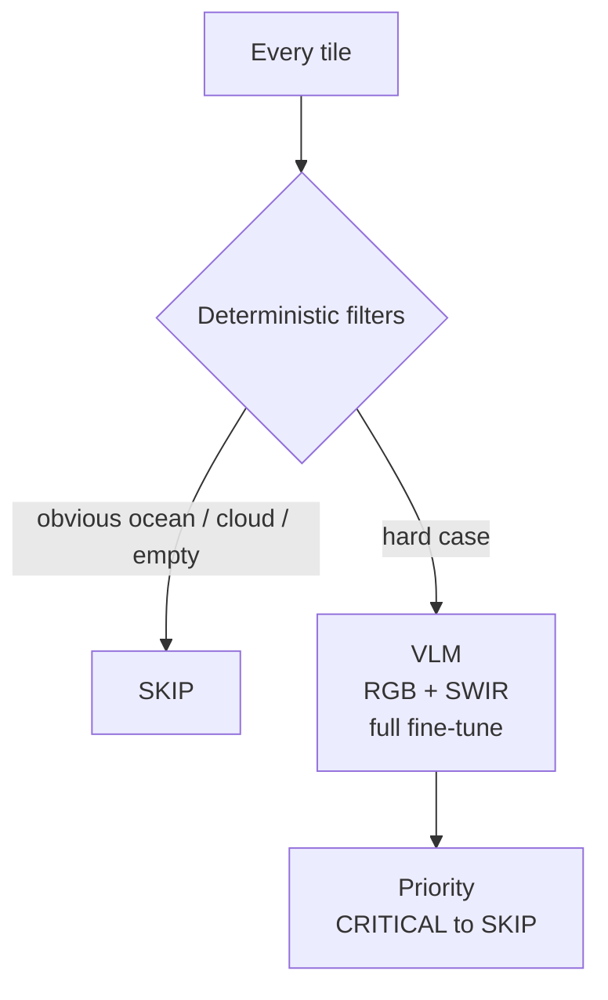
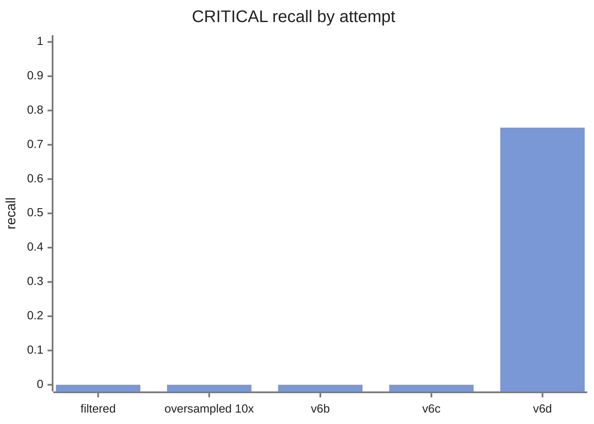

In April 2026 I did the Liquid AI x DPhi Space "AI in Space" hackathon. I learned a lot about how not to build a VLM for satellite imagery.

## Pitch

A satellite takes thousands of photos a day and can only downlink a handful per pass. Today that gets handled with narrow models: one CNN for clouds, one for fires, one for ships.

My plan was to put a single vision language model on the satellite. It looks at every tile, describes what it sees, and assigns a downlink priority from `CRITICAL` to `SKIP`. Change the prompt and you change what it looks for. No retraining, no new model upload.

The model was `LFM2.5-VL-450M`, fine-tuned on satellite imagery. The target was hazard triage: wildfire, flood, landslide.

## The first model was not good

The first fine-tune produced things like `<0>` and `[{"label":"Triage","value":"1"}]` instead of triage JSON.

Root cause: 48% of the training data was junk. VRSBench has three task types per image (captions, bounding boxes, one-word VQA answers), and my `_extract_caption()` function checked whether the string `[caption]` appeared in the model's response. It never does. That tag lives in the *human* prompt. So the function pulled every response indiscriminately, and half the "captions" the model learned from were the word "green" or "Yes".

## The second model was not good either

I filtered to caption-only data, bumped the learning rate, and retrained. Suddenly: 100% valid JSON, unique descriptions per image, correct schema. The dashboard reported **94.8% bandwidth savings**.

I thought I was done. I was not done. I had not tested the actual task once.

That 94.8% was the same kind of number as an accuracy score on a badly imbalanced dataset. Most satellite tiles are ocean, cloud, or empty land, so a model that says `SKIP` a lot will "save bandwidth" no matter how bad it is at spotting a fire. All the number told me was that the pipeline ran end to end. It said nothing about whether the output was any good.

## Building the eval I should have built first

So I put together a small hand-reviewed set of real Sentinel-2 hazard scenes with expected priorities. The fine-tuned model scored:

- `CRITICAL` recall: 0/3
- `HIGH` recall: 0/2

Across 45 samples it never once predicted `CRITICAL` or `HIGH`. On the Attica wildfire it wrote "a small town and a large parking lot".

## After that I fell into oversampling

Next attempt: add 17 hand-labeled hazard images, oversampled 10x. Training converged cleanly, eval loss 2.24 down to 1.03. Real-domain result: still 0 `CRITICAL`, 0 `HIGH`. Slightly *worse* than the untouched baseline on `HIGH`.

The reasons were structural. A better learning rate was never going to touch any of them:

1. 2,638 generic samples plus 50 hazard copies is 1.9% hazard signal. The model learned to write generic captions and fall back to `MEDIUM`.
2. RGB only. Active hazards show up strongest in shortwave infrared, so I was asking the model to find fires in the weakest band available to it.
3. LoRA only adapts the language head. The vision encoder, the part that actually has to learn what a burn scar looks like, stayed frozen.
4. 10 copies of 17 images teaches the model those 17 scenes by heart. It does not teach it what a flood looks like anywhere else.
5. The decision layer could downgrade `MEDIUM` to `LOW` but had no way to escalate. If the model never said `HIGH`, nothing downstream could put it back.

## The rebuild, and the version that shipped

I reframed the whole thing as a cascade: cheap deterministic filters reject obvious junk, the VLM only handles the hard cases. Dual RGB + SWIR input. Full fine-tune instead of LoRA. Frontier-model teacher labels. A temporal train/test split so Sentinel-2's 5-day revisit couldn't leak near-duplicates across it. And the real-domain eval running from the first day this time, not bolted on at the end.

| version | change | overall | CRITICAL recall |
|---|---|---|---|
| v6b | full fine-tune, dual image | 6/11 | 0/4 |
| v6c | 5x CRITICAL upsample | 6/11 | 0/4 |
| v6d | CRITICAL 10 to 30, MEDIUM 22 to 6 | 4/11 | 3/4 |

v6b and v6c collapsed everything to `MEDIUM` (recall 1.0, precision 0.55). v6d finally detected active hazards, but overall accuracy *dropped* to 36%, and reading the per-sample results it was mostly learning "this region is where floods happen" rather than "this image shows flooding". It over-escalated any tile near a flood-prone area.

I shipped v6d and called it a recall-first calibration appropriate for emergency triage, which is true, and also a generous way to describe a model that got 4 of 11 right.

On demo day, two of my scenario replays produced reliable detections. Both were the same Lahaina wildfire.

## What I actually took away

- Every proxy I optimized went green while the real task stayed broken: JSON validity, caption quality, the bandwidth-savings percentage. None of them were the actual job.
- Build the deployment-domain eval set before the first training run. If building it is painful, that pain is the signal that you don't really know what you're optimizing yet.
- If the class you care about has fewer than roughly 50 distinct real examples, you have a data collection problem, and no amount of oversampling or class weighting will paper over it.
- A 450M model under domain shift takes the cheapest signal it can find. Here the cheapest signal was "this looks like a flood-prone region", which is not the same as "this shows a flood".

I made the exact same core mistake again a few months later on [MarceLLo](/posts/marcello), but from another side of the problem.
