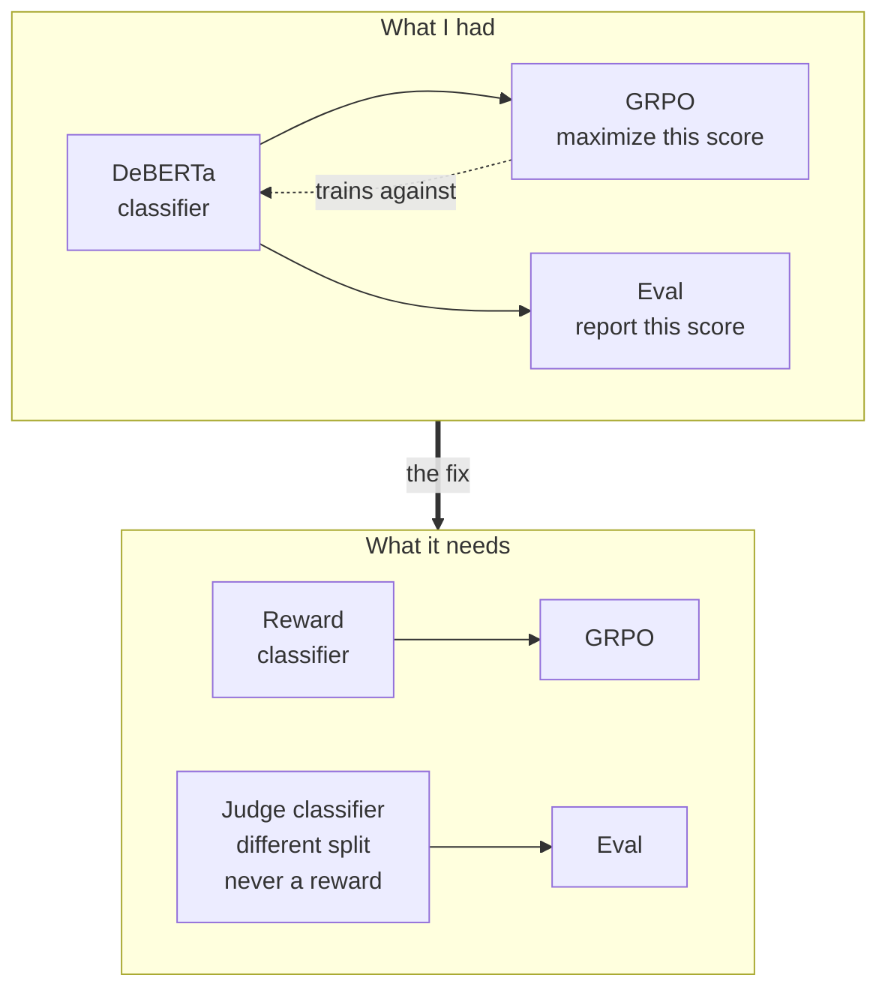
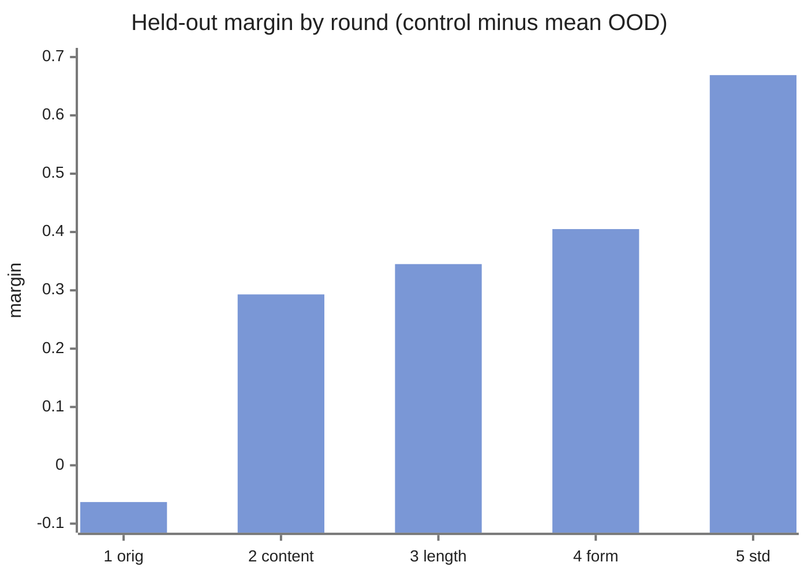
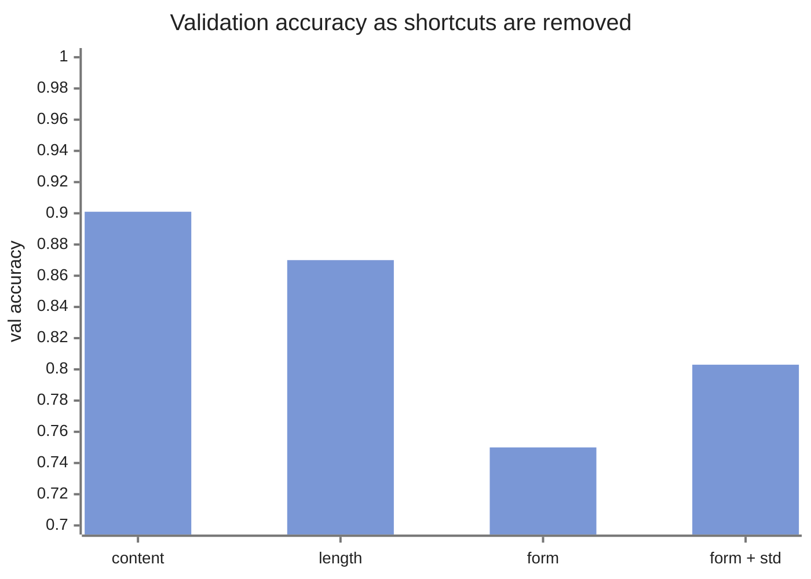

MarceLLo is an attempt to fine-tune a model to write like me. The method is reinforcement learning rather than plain fine-tuning: a classifier scores "how much does this sound like Marcelo", and GRPO pushes the model up that score. Same shape as DeepSeek-R1, except the reward is style instead of correctness. The model is `deberta-v3-small`.

The first end-to-end run finished in March. Classifier trained, reward pipeline stable, generations coming out. Then I asked someone to review it properly and got the whole thing taken apart.

## Feedback

Most of the feedback was fixable detail. Two things were structural.

The first: framing GRPO as an *alternative* to supervised fine-tuning is wrong.

They are sequential stages. R1 did SFT on cold-start data first, then used RL to refine a model that already knew the task. And R1's reward was verifiable, a math answer is right or it isn't. A learned classifier scoring vibes is noisy and gameable in a way a math checker is not.

The second: the evaluation was circular. My headline metric was the classifier's probability. That classifier was also the reward. GRPO's entire job is to make that number go up. After training it *would* go up, by definition, and that would tell me nothing.

I had made that exact mistake three months earlier on [automatic-downlink](/posts/automatic-downlink), where a bandwidth-savings percentage looked great while the model couldn't spot a wildfire. Here it was again, one project later.

## Reward classifier

So before any RL, one question: does the reward classifier even work?

The test: score a pile of texts it was never trained on and see what comes back. A Wikipedia paragraph, some Bécquer and Darío, a few English tech blogs, a couple of things in German and Italian since I don't write those. All of it should score low. Held-out samples of my own writing are the control, and they should sit above everything else.

It took five rounds to get there.

| round | mean OOD score | control | margin | failures |
|---|---|---|---|---|
| original corpus | 0.734 | 0.671 | **-0.063** | 11 of 11 |
| content-matched negatives | 0.380 | 0.674 | +0.293 | 5 |
| length-matched balancing | 0.254 | 0.599 | +0.345 | 2 |
| form-matched balancing | 0.276 | 0.681 | +0.405 | 2 |
| per-dimension standardisation | 0.155 | 0.824 | **+0.669** | 0 |

**Round 1.** The classifier scored random encyclopedia prose as *more* me than my own held-out writing. Every probe failed. The corpus was positives = my poems and posts, negatives = Wikipedia-style prose, so the classifier had learned to spot the topic and the register. It never had to look at the voice at all.

**Round 2.** Generate content-matched negatives: same themes, same language, generic voice. Margin goes positive.

**Round 3.** Length. Across the corpus, score correlated with word count at -0.34, and -0.39 *within the negatives alone*. Short text scored as me regardless of what it said. That is exactly what the four-line probe poems were exploiting. Fix: bin on word count, balance every bin.

**Round 4.** Verse form and language. Spanish verse in the corpus was 113 positives to 74 negatives, a 60% base rate for "me" from the shape of the text alone. Bécquer came back at 0.611, which is that base rate almost exactly. Fix: add Spanish verse negatives, make the balancer stratify on (length bin, language, verse) together so every surface cell is equal.

**Round 5.** This one was not the corpus. Frozen DeBERTa features plus plain logistic regression separated the corpus at AUC 1.000, while my trained classification head reached AUC 0.335 and collapsed to a constant. The head wasn't reading its own features. LayerNorm normalizes each sample across its 768 dimensions, which is not the same as putting the dimensions on a common scale across the corpus, so one high-variance dimension dominated the linear layer. Fix: fit a per-dimension mean and std on the training features, ship them as buffers. Bécquer went from 0.75 to 0.05, Darío from 0.77 to 0.24.

## What it cost

Validation accuracy dropped every time I removed a shortcut, then recovered once the head could use its features:

| corpus | val accuracy | AUC |
|---|---|---|
| content-matched | 0.901 | 0.948 |
| length-matched | 0.870 | 0.917 |
| form-matched | 0.750 | 0.827 |
| form-matched + standardised | **0.803** | **0.888** |

0.80 on a task with no shortcuts left is worth more than 0.90 on one where counting words was enough.

And there's a ceiling. Five-fold CV on frozen features puts `deberta-v3-small` at 0.820 ± 0.034. The trained classifier is at 0.803, so it's basically maxed out and there is nothing more to win from the head alone. One surprise from that sweep: the English-only DeBERTa still beat every multilingual backbone on a corpus that is more than half Spanish.

I expected the opposite.
