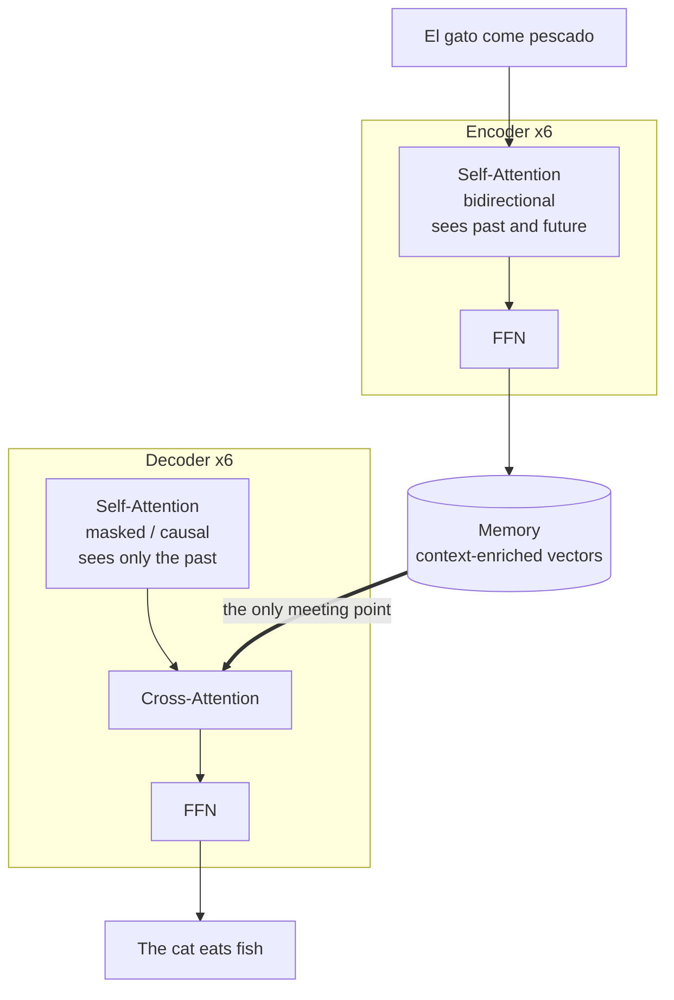

So a transformer is composed of two parts: the encoder and the decoder. 

Ok, the self-attention is the part of the encoder that is responsible for the attention mechanism.

Seeing the past means seeing the position of the previous tokens.

For example:

The cat eats a fish.

Ok, here 'cat' asks, 'What's the context?'.

We can see the past: 'The cat'.

Or see the past and future (bidirectional): 'The cat eats a fish'.

## Difference between encoder and decoder

An encoder is like reading an exam, and a decoder is like writing a book.

BERT was only for encoding.

GPT was only for decoding.

Why do we need encoding and decoding?

If you want to generate text and during training you let the model see the future:

TRAINING (with cheating):
"The cat eats fish"

The model learns: when I see "The cat", the answer is "eats"
                    (but cheated because saw "eats fish")

INFERENCE (real world):
"The cat ___"

The model: "What now? I don't have 'eats fish' to copy..."
            *generates garbage*

But if you use the model to understand (not generate), everything is perfect:

"The bank is near the river" -> What type of bank?

Seeing the whole sentence is NECESSARY, no cheating.

## When did the encoder and decoder meet?

The encoder makes a representation of the sentence for translation, for example:

> El gato come pescado

OK. Good! Now, the decoder generates the translation. But not without using *Self-Attention* to see the context of the sentence.

Now the vector of `cat` generates an array of vectors, but not like its meaning, it has self-attention now, so it's enriched with the context of the sentence. That's after many layers of self-attention.

This is the key, because it generates a memory that then will be consulted by the decoder to generate the translation.

Now inside the decoder, there are three levels of operations in each layer.

1. Self-attention (masked/causal)
2. Cross-attention
3. FFN (Feed-Forward Network)

The only part that meets the encoder and decoder is the cross-attention.

### When the attention formula is applied

And the attention formula is applied at two points:

1. In the encoder, in the self-attention part.
2. In the decoder, in the cross-attention part.

Like this:

ENCODER (6 layers):
    Layer 1: Self-Attention  ← 1 attention
    Layer 2: Self-Attention  ← 1 attention
    Layer 3: Self-Attention  ← 1 attention
    Layer 4: Self-Attention  ← 1 attention
    Layer 5: Self-Attention  ← 1 attention
    Layer 6: Self-Attention  ← 1 attention
                            ─────────────
                            6 attentions

DECODER (6 layers):
    Layer 1: Self-Attention + Cross-Attention  ← 2 attentions
    Layer 2: Self-Attention + Cross-Attention  ← 2 attentions
    Layer 3: Self-Attention + Cross-Attention  ← 2 attentions
    Layer 4: Self-Attention + Cross-Attention  ← 2 attentions
    Layer 5: Self-Attention + Cross-Attention  ← 2 attentions
    Layer 6: Self-Attention + Cross-Attention  ← 2 attentions
                                            ─────────────
                                            12 attentions
